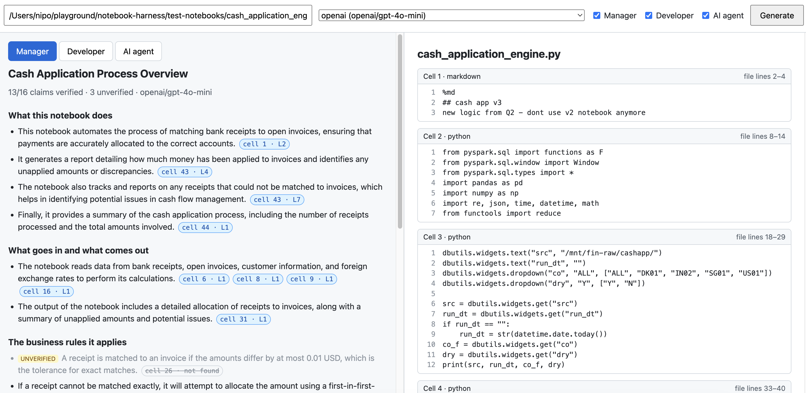
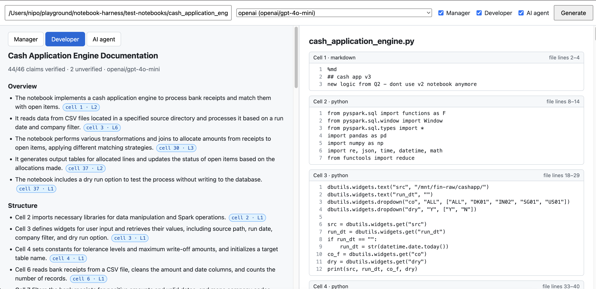
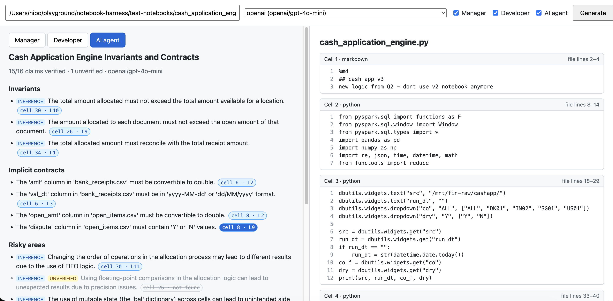

# notebook-harness

Notebook Documentation Harness: a small local web app that explains Databricks notebooks nobody understands.

Point it at a notebook on your disk and it writes three documents:

| Document | For | Covers |
|---|---|---|
| **Manager** | A non-technical owner of the process | What the notebook does in business terms, and what could go wrong |
| **Developer** | A developer new to the code | Structure, how data flows through it, and the rules it applies |
| **AI agent** | A coding agent that will debug or change it | Invariants, risky areas, and how to check that a change is safe |

Every claim cites the cell and lines it came from, and the harness checks each citation against the actual code. Clicking a citation in the app shows that code with the lines highlighted.

The notebook is only read, never executed.

## Quick start

```bash
cp .env.example .env    # then set GEMINI_API_KEY (free key: https://aistudio.google.com/apikey)
uv run harness          # opens http://127.0.0.1:8000
```

or, without a local Python:

```bash
docker compose up --build
```

Then enter the full path of a notebook, choose a provider and documents, and press **Generate**.

- **API keys** are read from `.env` (git-ignored) or the environment; variables set in your shell take precedence. Never put keys in `harness.yaml`: there, `api_key_env` is the *name* of the variable.
- **Docker** mounts your home directory read-only at the same path, so paths typed in the app work unchanged. It reaches Ollama and LM Studio on the host through `host.docker.internal`.
- **Privacy:** the notebook text is sent to the chosen LLM provider. Use a local provider (Ollama, LM Studio) if it must not leave the machine.

## Using the app

- **Top bar:** notebook path, provider, which documents to write, and **Generate**. Providers whose key isn't set are greyed out with the variable to set. Generate always writes fresh documents.
- **Left pane:** one tab per document. Progress shows live while it's written ("Writing document", "Repairing 2 claims…"); each document appears as soon as it's ready.
  - The summary line shows how many claims were verified, e.g. `22/25 claims verified · 3 unverified · openai/gpt-4o-mini`.
  - Each citation is a chip such as `cell 4 · L5`. Hover for the quoted code; click to show it.
  - **Inference** marks reasoning about consequences (risks, impact); everything else is a fact read from the code.
  - **Unverified** claims (no citation could be found in the code) are greyed out, and their citations struck through. A **dashed** chip means the code was found in a different cell than the model named.
  - Sections the model failed to write are listed in red.
- **Right pane:** the whole notebook, with cell line numbers and each cell's file lines. Clicking a chip scrolls to the cell and highlights the cited lines.

## Screenshots

All three documents below were generated from `test-notebooks/cash_application_engine.py` with `openai/gpt-4o-mini`.

### Manager

Business purpose, inputs and outputs, and business rules in plain language. 13 of 16 claims were verified. The matching-tolerance rule is marked **unverified** because its quote wasn't found in cell 26 (struck-through chip).



### Developer

Overview, then a cell-by-cell structure section, with the cell named in each claim. 44 of 46 claims were verified.



### AI agent

Invariants, implicit contracts about input columns and formats, and risky areas, most marked **inference**. 15 of 16 claims were verified; the highlighted chip (`cell 8 · L9`) is the citation that was clicked.



## Supported notebooks

- **Databricks source `.py`:** cells split on `# COMMAND ----------`; `# MAGIC %sql`, `%md`, `%run` and other magic cells; `# DBTITLE` cell titles. The `# MAGIC ` prefix is removed for display, and every line keeps its line number in the file.
- **Plain `.py`** without the Databricks header: treated as one Python cell.
- **Jupyter `.ipynb`**, including Databricks exports. These have no stable file lines, so only cell lines are shown.

Files must be UTF-8, given as an absolute path, and at most 2 MB (`limits.max_notebook_bytes`).

## How a document is generated

Each document is one request containing the whole notebook, so pressing Generate for all three makes three requests, run in parallel (`generation.max_concurrency`).

1. **Prompt:** the shared rules (`prompts/system.md`), the audience's instructions and section list (`prompts/<audience>.md`), and the notebook as `=== CELL N · lang · "title" ===` blocks, **without line numbers**.
2. **Structured reply:** the model returns JSON matching a schema: sections → claims → citations, each citation being a cell number and a verbatim code quote. The schema is sent in strict mode where the model supports it (OpenAI, Gemini, Anthropic), otherwise as plain JSON mode. Replies that aren't valid JSON for the schema are sent back with the error (`generation.max_parse_retries`, default 2).
3. **Required sections:** the section headings are read from the audience's prompt file. If any are missing or empty, the model is asked once more for just those. Sections are put back in prompt order.
4. **Citation check:** each quote is located in the code (see below). Claims with quotes that weren't found go back to the model once with a request for corrected quotes (`generation.max_repair_attempts`, default 1).
5. **Report:** each document carries a `validation` report: claims verified / partly verified / unverified, citations not found or relocated, repair attempts, and `missing_sections`.

A document usually takes 1–2 requests: the main one, plus a citation repair if any quotes don't match. At most there are three (main, missing sections, repair), each retried up to twice for invalid JSON. If one document fails, the others are still shown.

### How citations are enforced

The model never writes line numbers. It quotes code, and the harness finds the quote in the notebook and works out the lines itself (`backend/validation/quotes.py`):

- Matching ignores whitespace differences, blank lines, a leading `# MAGIC` and code fences, and treats `...` as a gap (spanning at most 40 lines).
- If the quote isn't in the named cell but appears in exactly one other cell, it's accepted, corrected to that cell, and marked `relocated`.
- Quotes under 4 non-space characters are rejected: they prove nothing.
- A quote matching several places in a cell uses the first, and reports `match_count`.
- A claim is **verified** if all its citations were found, **partial** if some were, and **unverified** if none were. Unverified claims stay in the document, visibly marked, rather than being dropped.

The check proves the quoted code exists where cited. It doesn't prove the sentence is a correct reading of that code.

## Configuration

Settings live in `harness.yaml`. Any value can use `${VAR}` or `${VAR:-default}`.

```yaml
provider: gemini                   # used when a run doesn't name one
providers:
  gemini:
    model: gemini/gemini-3.8-flash # any LiteLLM model string: https://docs.litellm.ai/docs/providers
    api_key_env: GEMINI_API_KEY    # name of the variable holding the key
  ollama:
    model: ollama_chat/qwen2.5-coder:14b
    api_base: ${OLLAMA_API_BASE:-http://localhost:11434}
    extra: { num_ctx: 32768 }      # passed to litellm.acompletion as-is
  # also configured: openai, anthropic, lmstudio
generation:
  temperature: 0.1
  timeout_s: 300
  max_repair_attempts: 1           # also gates the missing-sections request
  max_parse_retries: 2
  reserved_output_tokens: 8000
  max_concurrency: 3               # lower to 1 for tight free-tier rate limits
server: { host: 127.0.0.1, port: 8000, open_browser: true, static_dir: frontend/dist }
cache: { enabled: true, dir: .harness/cache }
limits: { max_notebook_bytes: 2000000 }
```

Provider fields: `model`, `api_key_env`, `api_base`, `extra`, `max_input_tokens`.

Environment overrides:

| Variable | Overrides |
|---|---|
| `HARNESS_CONFIG` | Path of the config file (default `harness.yaml` in the current folder) |
| `HARNESS_PROVIDER` | `provider` |
| `HARNESS_MODEL` | `model` of the active provider |
| `HARNESS_HOST`, `HARNESS_PORT` | `server.host`, `server.port` |
| `HARNESS_OPEN_BROWSER` | `server.open_browser` |
| `HARNESS_CACHE_DIR`, `HARNESS_STATIC_DIR` | `cache.dir`, `server.static_dir` |

```bash
HARNESS_PROVIDER=ollama uv run harness          # local model via Ollama
HARNESS_MODEL=gemini/<model> uv run harness     # another model, same provider
```

### Cache

Each generated document is saved under `.harness/cache/`, keyed by the notebook's SHA-256, the model and the prompt version (a hash of all prompt files, so editing a prompt invalidates old documents). The app always regenerates; API clients can reuse cached documents by starting a run without `force`.

## API

FastAPI, with interactive docs at `/docs` while the app runs.

```
GET  /api/health
GET  /api/providers                                   configured providers and whether their key is set
POST /api/notebooks              {path}               open a notebook; returns its id and cell summary
GET  /api/notebooks/{id}                              all cells, with cell and file line numbers
GET  /api/notebooks/{id}/cells/{n}?start=&end=        one cell, with lines start..end marked highlighted
POST /api/notebooks/{id}/runs    {audiences?, provider?, force?}   -> 202 {run_id}
GET  /api/runs/{id}                                   status, documents, errors per document
GET  /api/runs/{id}/events                            Server-Sent Events until the run finishes
```

- Starting a run returns 400 if the provider is unknown, its key isn't set, or the notebook doesn't fit the model's context window.
- Run events: `run_started`, `progress`, `document_ready`, `document_failed`, `run_finished`. A late subscriber gets all past events first.
- A citation's `cell` and `cell_lines` map directly to `GET /api/notebooks/{id}/cells/{cell}?start=..&end=..`.

## Development

```bash
uv run pytest           # backend tests; no network or API key needed
```

The tests replace `litellm.acompletion` with a fake that returns fixed replies, using a small sample notebook in `backend/tests/fixtures/`.

The built frontend is committed in `frontend/dist/`, so `uv run harness` needs no Node. To work on the frontend (Node 20.19+):

```bash
cd frontend
npm install
npm run dev      # http://localhost:5173, forwards /api to `uv run harness` on port 8000
npm run build    # rebuild frontend/dist/; commit it with your change
```

Docker builds the frontend itself in a separate build stage.

### Layout

```
backend/
  main.py                `harness` entry point: loads .env, starts uvicorn, opens the browser
  config.py              harness.yaml, ${VAR} expansion, HARNESS_* overrides, context limits
  parsing/               Databricks .py and .ipynb -> cells with cell and file line numbers
  llm/client.py          LiteLLM calls: strict JSON schema, retries, context check, error messages
  llm/schema.py          Pydantic models -> plain JSON schemas providers accept
  pipeline/prompts/      system, per-audience, repair and missing-section prompts
  pipeline/generate.py   one document: request, missing sections, citation check, repair
  pipeline/runs.py       background runs and their event log
  pipeline/cache.py      document cache
  validation/            quote matching and claim status
  api/                   FastAPI app and routes
  tests/
frontend/                React + TypeScript (Vite)
  src/api.ts             API types (copied from the Pydantic models) and calls
  src/App.tsx            top bar, run progress, document tabs
  src/DocumentView.tsx   sections, claims and citation chips
  src/NotebookView.tsx   notebook code with the cited lines highlighted
  dist/                  committed build, served by the backend at /
```

## Known limitations

- **No authentication.** The server binds to `127.0.0.1` and can read any notebook file the user can. Keep it local.
- **Provider errors aren't retried automatically.** Rate limits and "high demand" (503) errors, common on Gemini's free tier, show on the document's tab; press Generate again.
- **Notebooks larger than the context window are rejected, not split.**
- **Quality depends on the model.** Small models leave out sections and misquote more often. The harness catches and marks this, but can't make up for it.

## Design decisions

| Area | Chosen | Alternatives considered | Why |
|---|---|---|---|
| Citations | Model quotes code, harness finds the lines | Model writes line numbers (checked by regex); an evidence ledger built before writing, with claims citing anchor IDs | Models are bad at line numbers, and an invented quote fails to match. The ledger guarantees more but needs a whole extraction stage. |
| Pipeline | One prompt per document, whole notebook | One request for all three documents; per-cell summaries then combining; shared analysis then three writers | Simple, the documents fail independently and run in parallel. A single combined request risks output limits, thinner later documents and all-or-nothing failures. |
| LLM provider | LiteLLM | A small provider interface of our own | Many providers out of the box, configured by a model string. |
| Stack | Python 3.12, FastAPI, Pydantic, uv; in-process background runs with SSE; JSON file cache | Celery/Redis; SQLite | Enough for a local, single-user tool. |
| Frontend | React + TypeScript (Vite), build committed | Build on first start (needs Node); no build step | `uv run harness` stays one command with no Node needed. |
| Start | `uv run harness` and `docker compose up` | `make dev` | One command either way. |
| Unverifiable claims | Kept and marked `unverified` | Dropped silently | The reader sees what the model said and that it couldn't be backed up; nothing disappears without notice. |
| Document structure | Required sections read from the prompt files and enforced | Trust the model to follow the prompt | `gpt-4o-mini` returned one of five manager sections in testing. Reading headings from the prompt keeps one source of truth. |
| Oversized notebooks | Token check before sending; reject with a clear message | Split into chunks and merge | Splitting weakens claims that span cells and changes the one-prompt design; models with ~1M-token windows cover most notebooks. |

The original, longer design proposal is in the git history (commit `f5ceaba`).

## What I'd do next

-  Check that claims are true, not just that their code exists
-  Persist results
-  Experiment different prompts and use auto prompt optimizer
-  Add more context
-  Scale system